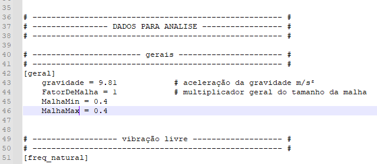

# FurnasDinamica


## Sumário
- [FurnasDinamica](#furnasdinamica)
  - [Sumário](#sumário)
  - [Descrição do Projeto](#descrição-do-projeto)
  - [Funcionalidades](#funcionalidades)
  - [Exemplo Visual](#exemplo-visual)
    - [Geometria Paramétrica](#geometria-paramétrica)
    - [Variação de Parâmetros](#variação-de-parâmetros)
    - [Malha 3D e Pontos de Carga](#malha-3d-e-pontos-de-carga)
    - [Resultados de Tensões e Deslocamentos](#resultados-de-tensões-e-deslocamentos)
    - [Modos de Vibração](#modos-de-vibração)
  - [Como Executar](#como-executar)
  - [Visualização no ParaView](#visualização-no-paraview)
  - [Monitoramento (Opcional)](#monitoramento-opcional)
  - [Sobre os Arquivos de Resultado](#sobre-os-arquivos-de-resultado)
  - [Referências e Contato](#referências-e-contato)

---

## Descrição do Projeto

Sistema automatizado para análise de elementos finitos (FEM) focado em radiers estaqueados em tronco de cone, utilizando GMSH, CalculiX, CGX e ParaView. Permite geração paramétrica de geometria, malha, análise estática, modal e dinâmica, com pós-processamento visual.

---

## Funcionalidades
- Geração paramétrica de geometrias complexas
- Controle de materiais e unidades via TOML
- Exportação de malha e resultados para CalculiX e ParaView
- Visualização de tensões, deslocamentos, modos de vibração e séries temporais
- Totalmente automatizado para Linux

---

## Exemplo Visual

### Geometria Paramétrica


### Variação de Parâmetros


### Malha 3D e Pontos de Carga


### Resultados de Tensões e Deslocamentos



### Modos de Vibração


---

## Como Executar

1. **Ative o ambiente virtual:**
   ```bash
   cd FurnasDinamica
   source venv/bin/activate
   ```
2. **Execute o teste:**
   ```bash
   python executar_teste.py
   ```
   Os resultados serão gerados em `teste/resultados_teste_estatico/`.

---

## Visualização no ParaView
Abra o ParaView e carregue o arquivo `.vtu` ou `.frd` em:
```
FurnasDinamica/teste/resultados_teste_estatico/
```
- Use filtros como **Slice** para cortes internos
- Selecione variáveis como `S:von_mises` para tensões
- Navegue entre modos de vibração usando o controle de tempo

Exemplo de visualização:


---

## Monitoramento (Opcional)
Scripts opcionais/experimentais para acompanhar o progresso do CalculiX:
- `monitorar_ccx.py` (Python, requer `psutil`)
- `monitor_simples.sh` (Bash)

> **Atenção:** Os scripts de monitoramento são experimentais e não foram totalmente testados em produção.

---

## Sobre os Arquivos de Resultado
Os arquivos de resultado `.frd` e `.vtu` são grandes e estão incluídos no repositório para referência e validação.

---

## Referências e Contato
- Projeto automatizado para Furnas
- Para dúvidas ou sugestões, entre em contato com o responsável pelo projeto.
- Baseado em consultoria e relatório técnico ESPer Engenharia

---

*Este projeto está configurado para ser privado no GitHub. Não compartilhe publicamente sem autorização.* 