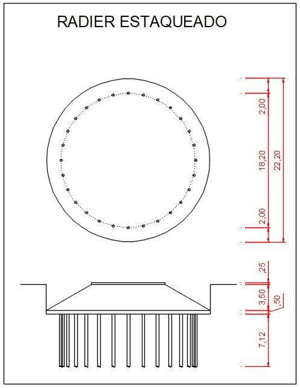
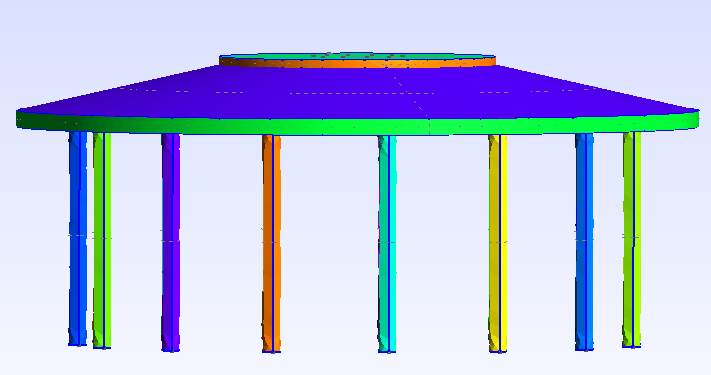
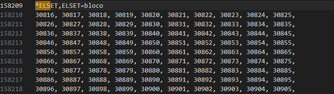
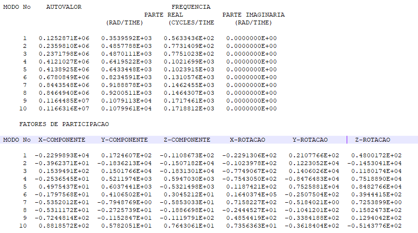

# FurnasDinamica — Relatório Ilustrado

Este documento apresenta, de forma ilustrada e didática, as principais etapas, funcionalidades e resultados do sistema FurnasDinamica, aproveitando o conteúdo visual e as legendas do relatório técnico original.

---

## 1. Descritivo do Objeto

O projeto visa a implementação e validação de uma rotina automatizada para análise estrutural de radier estaqueado, com integração computacional para modelagem, análise e pós-processamento.

---

## 2. Geração Paramétrica da Geometria

A geometria do radier estaqueado é totalmente parametrizável, permitindo variações de diâmetros, alturas, número e dimensões das estacas.

**Figura 1: Tipologia do radier-estaqueado para parametrização.**

**Figura 2: Dados de entrada para controle da geometria paramétrica (formato TOML).**

---

## 3. Variação de Parâmetros

A seguir, exemplos de variação dos principais parâmetros geométricos:

**Figura 3: Variação do diâmetro da base: 2220 cm (esq.), 1400 cm (dir.).**

**Figura 4: Variação do diâmetro do topo: 900 cm (esq.), 500 cm (dir.).**

**Figura 5: Variação da altura da base: 50 cm (esq.), 150 cm (dir.).**

**Figura 6: Variação da altura do tronco de cone: 350 cm (esq.), 150 cm (dir.).**

**Figura 7: Variação da altura do topo: 25 cm (esq.), 100 cm (dir.).**

**Figura 8: Variação do número de estacas: 15 (esq.), 10 (dir.).**

**Figura 9: Variação do diâmetro das estacas: 30 cm (esq.), 100 cm (dir.).**

**Figura 10: Variação da distância da face externa da base até o eixo das estacas: 200 cm (esq.), 400 cm (dir.).**

**Figura 11: Variação da altura das estacas: 712 cm (esq.), 1512 cm (dir.).**

---

## 4. Geração e Controle de Malha

A rotina permite controle refinado da malha, incluindo tamanho mínimo/máximo e multiplicador global.

**Figura 12: Elemento tetraédrico implementado: GMSH (esq.), pontos de aplicação da carga dinâmica (dir.).**

**Figura 13: Controle global da malha no arquivo de entrada.**

---

## 5. Estrutura dos Arquivos de Entrada para o Solver

**Figura 14: Estrutura do *NODE.**

**Figura 15: Estrutura do *ELEMENT (esq.), elemento C3D4 (dir.).**

**Figura 16: Estrutura do *NSET.**

**Figura 17: Estrutura do *ELSET.**

---

## 6. Resultados de Análise Estática

A rotina exporta resultados de tensões e deslocamentos para visualização no ParaView.

**Figura 18: Tensões Magnitude.**

**Figura 19: Tensões normais σxx.**

**Figura 20: Tensões normais σyy.**

**Figura 21: Tensões normais σzz.**

**Figura 22: Tensões cisalhantes σxy.**

**Figura 23: Tensões cisalhantes σyz.**

**Figura 24: Tensões cisalhantes σxz.**

**Figura 25: Deslocamentos devido ao carregamento estático.**

---

## 7. Resultados de Análise Modal

A rotina permite calcular e exportar os modos de vibração para visualização no ParaView.

**Figura 26: Critérios para cálculo modal.**

**Figura 27: Relatório da vibração livre.**

**Figura 28: Primeiros 4 modos de vibração.**

---

## 8. Resultados de Análise Dinâmica

A análise dinâmica de vibração forçada também pode ser visualizada no ParaView.

**Figura 29: Deformada da seção e Time-history de ponto escolhido.**

---

## 9. Tensões Principais

**Figura 30: Valores e direções principais de σ1, σ2 e σ3 do tensor de Cauchy.**

---

## 10. Instruções Técnicas e Execução

- Veja o README principal para detalhes de instalação, execução e configuração.
- Todos os resultados apresentados podem ser reproduzidos seguindo o fluxo do projeto.
- As imagens acima são exemplos reais gerados pelo sistema.

---

*Este documento é um resumo ilustrado do funcionamento e resultados do FurnasDinamica, baseado no relatório técnico original.* 